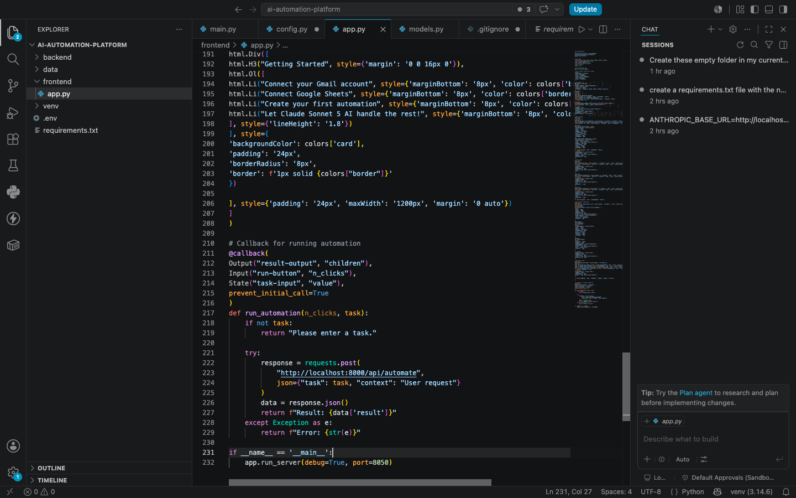
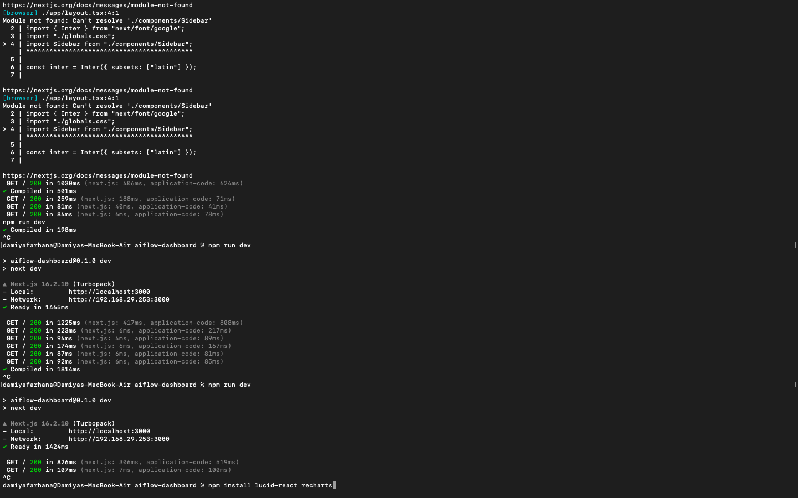
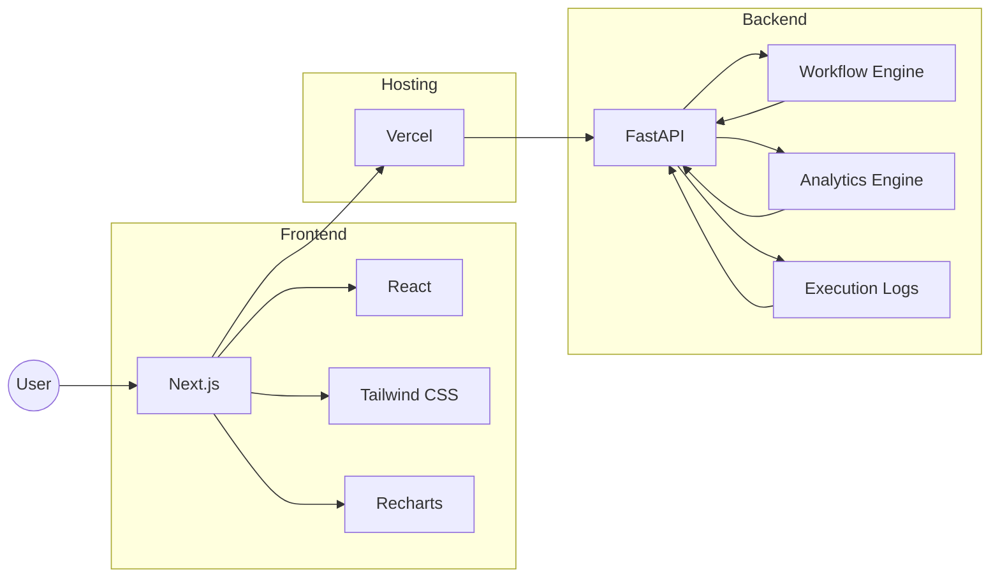

# 🚀 AiFlow Dashboard

<p align="center">
<strong>A high-performance AI-powered SaaS dashboard for monitoring automation workflows, tracking AI model usage, and visualizing real-time analytics.</strong>
</p>

<p align="center">
Built with Next.js, React, Tailwind CSS, FastAPI, and Recharts.
</p>

---

## 📸 Dashboard Preview


> **Note:** Save your main dashboard screenshot as **`dashboard.png`** inside the `screenshots` folder.

---

# 📷 Project Gallery

### Dashboard Overview


> Main analytics dashboard displaying AI requests, latency, workflow metrics, and model usage.

---

### Workflow Builder



> Visual workflow editor for creating and managing AI automation pipelines.

---

### Backend Integration


> FastAPI backend powering workflow execution, analytics, and API communication.

---

### Source Code



> Clean and modular codebase built with modern development practices.

---

# 🏗️ System Architecture



---

# ✨ Features

- 📊 Real-time analytics dashboard
- 🤖 AI model usage tracking
- ⚡ Workflow monitoring
- 📈 Interactive charts and visualizations
- 📜 Execution logs
- 🔄 API-driven architecture
- 📱 Responsive UI
- 🎨 Modern dark theme
- 🚀 High-performance frontend
- 🔗 FastAPI backend integration

---

# 🛠️ Tech Stack

### Frontend

- Next.js
- React
- Tailwind CSS
- Recharts
- Lucide React

### Backend

- Python
- FastAPI

### Deployment

- Vercel

---

# 📂 Project Structure

```text
AiFlow-Dashboard/
│
├── app/
├── public/
├── screenshots/
│ ├── dashboard.png
│ ├── workflow-builder.png
│ ├── backend-integration.png
│ └── code.png
│
├── README.md
├── package.json
├── tailwind.config.js
└── tsconfig.json
```

---

# 🚀 Getting Started

## Clone the repository

```bash
git clone https://github.com/your-username/aiflow-dashboard.git

cd aiflow-dashboard
```

---

## Install dependencies

```bash
npm install
```

---

## Start the development server

```bash
npm run dev
```

or

```bash
yarn dev
```

or

```bash
pnpm dev
```

Open:

```
http://localhost:3000
```

---

## Backend (FastAPI)

```bash
cd backend

python -m venv venv
```

Activate the environment.

### macOS/Linux

```bash
source venv/bin/activate
```

### Windows

```bash
venv\Scripts\activate
```

Install dependencies

```bash
pip install -r requirements.txt
```

Run the API

```bash
uvicorn main:app --reload
```

Open:

```
http://localhost:8000
```

Interactive API documentation:

```
http://localhost:8000/docs
```

---

# 📈 Dashboard Modules

- AI Request Analytics
- Workflow Monitoring
- Execution Tracking
- AI Model Usage
- API Integrations
- Execution Logs
- Performance Metrics

---

# 🚀 Future Improvements

- Authentication
- Role-Based Access Control
- AI Cost Tracking
- Multi-Workspace Support
- Team Collaboration
- Notifications
- Workflow Templates
- Dark / Light Theme Toggle

---

# 🤝 Contributing

Contributions are welcome.

1. Fork the repository

2. Create a feature branch

```bash
git checkout -b feature/new-feature
```

3. Commit your changes

```bash
git commit -m "Add new feature"
```

4. Push to GitHub

```bash
git push origin feature/new-feature
```

5. Open a Pull Request

---

# 📄 License

This project is licensed under the **MIT License**.

---

# 👨‍💻 Author

**Syed Muizur Rohman**

Finance Graduate • AI Automation Enthusiast • Full-Stack Developer • SEO & Digital Growth

If you found this project helpful, consider giving it a ⭐ on GitHub.
